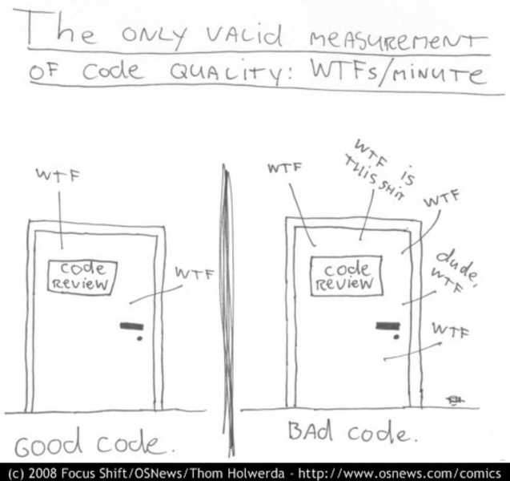

# Good Coding Practices
---
## What is Bad Code?
+++

+++
## READABILITY
+++
### Readability
1. Inconsistent naming scheme (code and files)
2. Too deep nesting
3. Abusing the language (ex: nested ternary operators)
4. Infinite line length
5. Not meaningful names (or too short/long)
6. No line separation

+++?code=code/readability_bad.js&lang=javascript&title=Readability Bad
@[1](Function name and parameters don't show meaning or intention)
@[2](Var name not meaningful)
@[4-6]("Magic value" lost in middle of code, not reusable)

+++?code=code/readability_good.js&lang=javascript&title=Readability Good

+++?code=code/variable_naming.js&lang=javascript&title=Variable names
@[1-2](Why? unpronounceable, no meaning)
@[4-5](Clear meaning, pronounceble, searchable)

+++
## COMMENTS
+++
### Comments
1. Zero comments
2. Too extensive (if you need to explain much, is sign of bad code)
3. Captain Obvious
4. Calendar reminder or blaming comments
5. Mark ending of functions

+++?code=code/comments_bad1.js&lang=javascript&highlight=shit&title=Comments Bad
@[1-2](Captain Obvious attack)
@[4](Not needed, any IDE can mark this better)
@[6-7](This info already is on GIT, not useful here)
@[9-13](Funny, consider standup comedy instead of programming)
@[15](Use propper language)

+++?code=code/comments_bad2.js&lang=javascript&title=Comments Bad (cont)
@[1-10](Developers wasting 42 hours?)

+++
## CODE SMELLS
+++
### Code smells
1. God class/method
2. Duplicated code
3. Too many parameters
4. Dead code

+++?code=code/duplicate_code.js&lang=javascript&title=Duplicated code
@[1-12](Two functions, same functionality)
@[14-19](Simpler, reusable and not duplicated)

+++?code=code/parameter_count.js&lang=javascript&title=Too many arguments
@[1-4](too many positional arguments)
@[6-9](destructuring from single argument)
@[10-15](order of arguments doesn't matter on call)

+++?code=code/dead_code.js&lang=javascript&title=Dead Code
@[3-6](Don't leave this commented out, remove it!)
@[10](If your IDE shows you unused methods, remove them)

---
## Creating Good Code

+++
## GENERAL RULES
+++
### General rules
1. Follow language standard conventions.
2. Choose a set of rules and guidelines and stick to them.
3. Keep it simple. Simpler is always better. Reduce complexity as much as possible.
4. Boy scout rule. Leave the campground cleaner than you found it.
5. Don't sacrifice clarity for efficiency.

+++
## READABILITY
+++
### Readability tips
1. Be consistent. If you do something a certain way, do all similar things in the same way.
2. Use self-explanatory variables.
3. Group concept together. Leave a blank line when you start a different thing.
4. Keep lines short.

+++?code=code/consistency.js&language=javascript&title=Consistency

+++
## NAMING
+++
### Names rules
1. Choose descriptive and unambiguous names.
3. Use pronounceable names.
4. Use searchable names.
5. Replace magic numbers with named constants.

+++?code=code/name_rules1.js&lang=javascript&title=Name Rules
@[1-2](Magic number and no clear intention)
@[4-6](Searchable name and add meaning)

+++?code=code/name_rules2.js&lang=javascript&title=Name Rules (cont)
@[1-2, 4-8](What are the params of saveCityZipCode?)
@[1-2, 10-12](Simpler to read, clear parameters)

+++
## FUNCTIONS
+++
### Functions rules
1. Small.
2. Do one thing.
3. Use descriptive names. Show intention.
4. Prefer fewer arguments. Avoid four arguments or have a good justification for it.
5. Do something, return something.
6. Have no side effects.

+++?code=code/one_thing.js&lang=javascript&title=Small & do one thing
@[1-8](Two things)
@[10-13](Refactor to smaller and simpler functions)

+++?code=code/side_effects.js&lang=javascript&title=Side effect
@[1-6](Modify external value inside function)
@[8-14](Refactor to remove side effect)

+++
## COMMENTS
+++
### Comments rules
1. Least as possible. Always try to explain yourself in code.
2. Don't be redundant or add obvious noise.
4. Don't comment out code. Just remove.
5. Use as clarification of code.
6. Use as explanation for weird cases.
7. Use to explain why the code is doing something, and not what is doing.

+++
## Version Control
+++
### Versioning guidelines
1. Short and meaningful commit messages.
2. Keep your commits polite and clean.
3. Write what the commit will do once applied. No past tense.
4. Semantic messages.
5. Reference your Issue tracker if you are using one.

+++
### Versioning guidelines (cont.)
6. Explain _what_ and _why_ and not _how_.
7. Rebase your branch before merging.
8. Use feature branches.
9. Separate your commits properly.
10. Avoid `git add .` all the time. You are the first reviewer.
11. Do a quick review of your code **before** pushing.  

+++
### Before writting a commit message think this

> When applied, this commit will... &lt;YOUR_COMMIT_MESSAGE_HERE&gt;

+++?code=code/commit_messages.md&language=markdown&title=Commit messages
@[1, 2](Past tense)
@[1, 3](Ambiguos message)
@[1, 4](Issue reference dificult reading the message)
@[6-9](Better messages)

---
## How to stay in the Good Track

+++
## DEV TOOLS
+++
### Dev Tools
- Quality and Style tools
  - [Editorconfig](https://editorconfig.org/)
  - [StandardJS](https://standardjs.com/)
  - [ESLint](https://eslint.org)
- Good IDE 
  - [VSCode](https://code.visualstudio.com)
  - [WebStorm](https://www.jetbrains.com/webstorm/)

+++
### Automation
- Pass the linter on every commit. Even before tests (GitlabCI).
- Submit your code to an static analyzer (Codeclimate, SonarQube, etc).
- Add semantic-release to your pipeline.
- Generate automatic `CHANGELOG` file. 

+++
## CODE REVIEW
+++
### Code Review
- Only review after automatic check already past (linter, tests).
- Read carefully. Take your time to understand what's changed.
- Look for signs of bad code or code smells.
- Look for inconsistencies that may have pass the linter.
- Never merge your own PRs.

+++
### Code Review (cont.)
- Ask questions. Suggest changes.
- Do in-person review if:
  - Changes is too big or complex. 
  - There is a difference in experience or expertise. 
- Always be positive in your comments.

+++
## PAIR PROGRAMMING
+++
### Pair Programming
- Plan and discuss briefly before coding.
- When driving always communicate what your are doing. 
- When navigating be alert and pay attention.

+++
### Pair Programming (cont.)
- Disagreement is good, talk it through, find the best solution.
- Don't do it for long period of time.
- Exchange roles of driver/navigator.

+++

@snap[midpoint]
# Thanks!
@snapend
